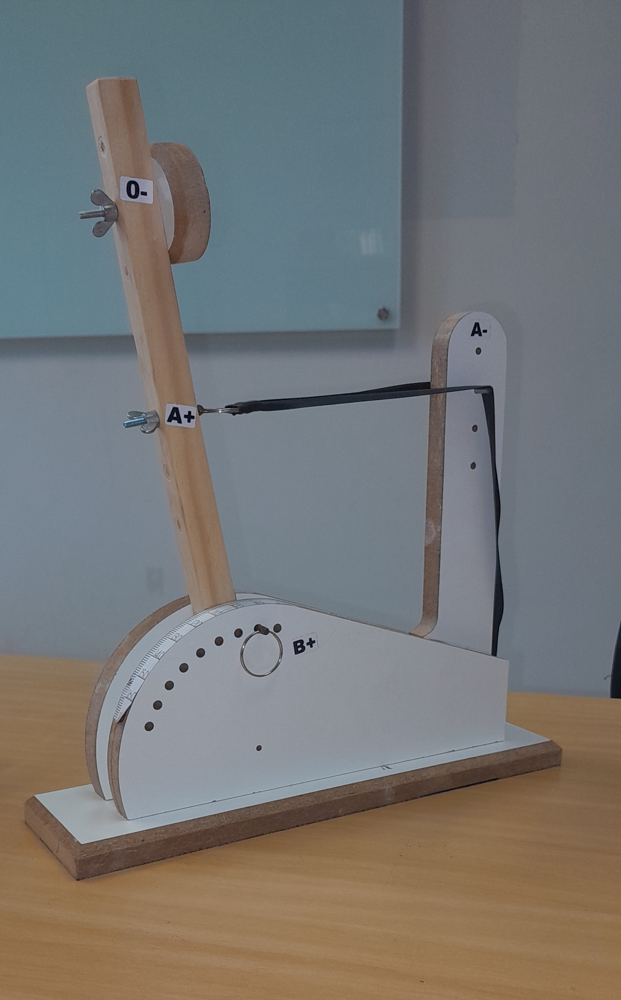

---
# Só mude aqui!!!!
author: "Igor e Lucas"
title: "Relatório de Experimento da Catapulta"
bibliography: referencias.bib
# A partir daqui nao faca alteracoes!!!!!
link-citations: true
csl: associacao-brasileira-de-normas-tecnicas-ipea.csl
subtitle: "<a href='https://bendeivide.github.io/courses/epaec/' target='_blank'>Estatística e Probabilidade</a> </br> <a href='https://bendeivide.github.io' target='_blank'>Prof. Ben Dêivide (DEFIM/CAP/UFSJ)</a>"
include-before-body: header.html
date: now
date-format: "DD/MM/YYYY, HH:mm"
lang: pt-BR
format:
  html:
    toc: true
    toc-depth: 3
    toc-location: right
    toc-expand: true
    smooth-scroll: true
    number-sections: true
    theme: cosmo

execute: 
  echo: true
  warning: false
  message: false

---


## Relatório de Experimento: Estatística e Probabilidade com Catapulta

## Introdução

Este relatório detalha um experimento prático realizado no âmbito da disciplina de Estatística e Probabilidade da UFSJ, com foco na análise de dados coletados a partir de lançamentos de uma catapulta. O objetivo principal foi investigar a variabilidade dos resultados de lançamento sob configurações fixas e aplicar técnicas de análise estatística para interpretar os dados obtidos.

## Metodologia e Prática Experimental

O experimento da catapulta serve como uma base prática para a coleta de dados reais e a aplicação de técnicas de análise estatística. A catapulta utilizada no experimento permite o controle de diversos fatores que influenciam o lançamento, como a tensão do elástico, o ângulo de disparo e o apoio estrutural.

Para a realização dos lançamentos, uma configuração específica foi mantida constante na catapulta:

*   **Posição O-**: Nível 2
*   **Posição A+**: Nível 3
*   **Posição B+**: 90°
*   **Posição A-**: Nível 4


## Funcionamento Mecânico da Catapulta e Configuração Utilizada

Uma catapulta opera convertendo energia potencial armazenada em energia cinética, que é então transferida para um projétil. No contexto do experimento, a catapulta utiliza um braço de lançamento que é puxado para trás contra uma força de resistência de um elástico. Ao ser liberado, o braço acelera rapidamente, impulsionando o projétil. Os principais componentes e seu funcionamento são:

• Braço de Lançamento (Posição A): parte móvel que segura e impulsiona o projétil. Sua trajetória e velocidade final são críticas para o alcance.

• Mecanismo de Tensão (Elástico): Armazena a energia potencial. A força aplicada pelo elástico determina a aceleração inicial do braço e, consequentemente, a velocidade do projétil.

• Ponto de Apoio/Pivô (Posição O): O eixo em torno do qual o braço de lançamento gira. A estabilidade e a posição deste ponto são essenciais para a consistência do movimento.

• Base Estrutural: Fornece a estabilidade necessária para o sistema, garantindo que a energia seja direcionada para o lançamento e não para o movimento indesejado da própria catapulta.

recapitulando: 

*   **Tensão do Elástico (Posição A)**: Controla a força e a velocidade inicial do projétil.
*   **Ângulo de Disparo (Posição B)**: Define o tempo de voo e o alcance horizontal do projétil.
*   **Apoio Estrutural (Posição O)**: Garante a estabilidade e a geometria do movimento da catapulta.


{width=40%}

## Coleta de Dados

Foram realizados 22 lançamentos sob as configurações fixas mencionadas. Foram selecionados membros do curso para dividir as tarefas, a fim de garantir a qualidade do lançamento, da coleta e do registro dos dados apresentados. Mais especificamente, duas pessoas ficaram responsáveis pela etapa de lançamento, duas pela etapa de coleta, uma pelo registro dos dados coletados em planilha e uma pelo registro geral da atividade, realizado de forma manuscrita. Apesar da manutenção das mesmas configurações, foram obtidas diferentes distâncias de lançamento. Esta variabilidade observada é um ponto central para a análise estatística, pois permite identificar e discutir os fatores que contribuem para a dispersão dos resultados.

### Ordenação de Dados (Rol)

Para facilitar a análise estatística, os dados brutos coletados foram organizados em um **rol**, que é a disposição dos valores em ordem crescente. Essa organização inicial é crucial para a visualização da distribuição dos dados e para o cálculo de medidas de posição como a mediana e os quartis.

**Dados Brutos (Alcance em cm):**
`326.0, 294.8, 296.8, 294.0, 295.8, 298.5, 300.6, 285.1, 287.1, 292.3, 290.8, 287.9, 282.9, 285.3, 281.5, 278.4, 276.4, 281.7, 277.1, 285.3, 277.1, 281.8`

**Rol (Alcance em cm):**
`276.4, 277.1, 277.1, 278.4, 281.5, 281.7, 281.8, 282.9, 285.1, 285.3, 285.3, 287.1, 287.9, 290.8, 292.3, 294.0, 294.8, 295.8, 296.8, 298.5, 300.6, 326.0`

## Análise da Variabilidade e Aprendizado

A observação de resultados não idênticos, mesmo com configurações fixas, ressalta a importância da estatística na compreensão de fenômenos com variabilidade inerente. Os principais fatores que podem ter contribuído para essa variabilidade incluem:

*   Pequenas modificações na execução de cada lançamento.
*   Influência de fatores ambientais não controláveis, como correntes de ar.
*   Limitações e variações nos instrumentos utilizados, como a elasticidade do elástico ao longo do tempo.

## Medidas Estatísticas

Para a análise dos dados coletados, as seguintes medidas estatísticas foram calculadas, (considerando o estágio de conhecimento no dia da coleta desses dados):

*   **Média**: 288.96 cm. Representa o ponto central em torno do qual os dados se concentram.
*   **Mediana**: 286.20 cm. Indica o valor central dos dados, sendo menos sensível a valores extremos.
*   **Mínimo**: 276.40 cm.
*   **Máximo**: 326.00 cm.

Essas medidas são cruciais para compreender a distribuição dos lançamentos e facilitar as análises estatísticas básicas.

## Conclusões Estatísticas

Com base nos dados coletados e nas medidas estatísticas calculadas para o experimento da catapulta, podemos tirar algumas conclusões fundamentais, utilizando apenas conceitos básicos de estatística descritiva:

• Variabilidade Observada: Mesmo mantendo as configurações da catapulta fixas, observamos que os alcances dos lançamentos não foram idênticos. Isso demonstra a variabilidade inerente em qualquer processo real, mesmo sob condições controladas. A estatística nos ajuda a quantificar e entender essa variabilidade, em vez de esperar resultados perfeitos e idênticos.

• Medidas de Tendência Central: A média (288.96 cm) e a mediana (286.20 cm) nos dão uma ideia do valor
central dos lançamentos. A proximidade entre a média e a mediana sugere que os dados não estão excessivamente distorcidos por valores extremos, embora a mediana seja mais robusta a eles.

• Amplitude dos Dados: A amplitude (49.60 cm), que é a diferença entre o valor máximo (326.00 cm) e o mínimo (276.40 cm), nos mostra a extensão total dos resultados obtidos. Isso nos dá uma ideia da faixa de valores que os lançamentos podem atingir sob as condições do experimento.

• Identificação de Valores Atípicos: A análise nos permitiu identificar um valor atípico (326.0 cm). Este é um lançamento que se destaca significativamente dos demais. Em estatística básica, a identificação de valores atípicos é importante porque eles podem indicar eventos incomuns, erros de medição ou simplesmente variações extremas que merecem investigação. No contexto da catapulta, um valor atípico pode ter sido causado por uma execução ligeiramente diferente ou um fator externo momentâneo.

## Aplicação do Pacote `leem` (R) na Análise de Dados

Para a análise estatística dos dados coletados no experimento da catapulta, o pacote `leem` (Laboratório de Ensino de Estatística e Matemática), desenvolvido pelo Prof. Ben Dêivide da UFSJ, oferece um conjunto de ferramentas didáticas e funcionais em linguagem R. Este pacote é particularmente útil para o ensino e a prática de estatística, permitindo a exploração de conceitos de forma interativa e visual.

### Exemplos de Aplicação do `leem`

Com os dados brutos do experimento agora disponíveis, a aplicação do `leem` pode seguir os seguintes passos gerais:

1.  **Importação e Organização dos Dados**: Os dados de alcance dos lançamentos seriam importados para o ambiente R. O `leem` pode auxiliar na criação de objetos de dados estruturados para facilitar a análise.
2.  **Cálculo de Medidas Descritivas**: Utilizar funções do `leem` para calcular rapidamente a média, mediana, desvio padrão, variância, quartis e outras medidas descritivas dos alcances. Isso forneceria um resumo quantitativo da performance da catapulta.
3.  **Visualização de Dados**: O pacote `leem` permite a criação de gráficos estatísticos essenciais, como histogramas, e gráficos de dispersão. Essas visualizações são cruciais para entender a distribuição dos dados, identificar valores atípicos e observar padrões.
    *   **Histograma**: Para visualizar a frequência dos diferentes alcances e a forma da distribuição.
4.  **Análise de Variabilidade**: Explorar a variabilidade dos lançamentos, possivelmente comparando diferentes configurações (se houvesse mais de uma) ou analisando a consistência ao longo do tempo. O `leem` pode oferecer funções para testes de hipóteses simples ou análises de variância, se aplicável.
5.  **Simulações e Modelagem**: Para um estudo mais avançado, o `leem` pode ser empregado em simulações para entender o comportamento probabilístico dos lançamentos ou para construir modelos simples que relacionem os fatores controlados com o alcance.

O uso do `leem` no contexto deste experimento reforça a importância da computação estatística como uma ferramenta poderosa para a análise de dados reais, permitindo que os estudantes apliquem conceitos teóricos em um cenário prático e obtenham *insights* significativos sobre a variabilidade e o desempenho da catapulta.

### Principais Resultados Numéricos

A tabela a seguir resume as principais medidas estatísticas calculadas para os alcances dos lançamentos:

| Medida Estatística | Valor (cm) |
| :----------------- | :--------- |
| Média              | 288.96     |
| Mediana            | 286.20     |
| Mínimo             | 276.40     |
| Máximo             | 326.00     |
| Amplitude          | 49.60      |

A **média** de 288.96 cm indica o valor central dos alcances, enquanto a **mediana** de 286.20 cm, ligeiramente menor, sugere uma possível assimetria à direita na distribuição dos dados, influenciada por valores mais altos.

### Discussão dos Resultados

Os resultados obtidos estão em grande parte de acordo com o esperado para um experimento físico controlado, mas sujeito a variabilidades inerentes. A presença de uma **grande variabilidade**, evidenciada pelo desvio padrão e pela amplitude, significa que, mesmo com a configuração fixa da catapulta, os lançamentos não são perfeitamente replicáveis. Isso é um conceito fundamental em estatística: a variabilidade é uma característica intrínseca de qualquer processo real [1].

Os fatores que podem ter influenciado esses resultados e as possíveis fontes de erro experimental incluem:

*   **Variações na Execução**: Pequenas diferenças na forma como o operador armava ou liberava a catapulta em cada lançamento podem introduzir variabilidade. A precisão humana é limitada e pode levar a pequenas inconsistências [4].
*   **Fatores Ambientais**: Correntes de ar, mesmo que sutis, podem afetar a trajetória do projétil. Embora o experimento tenha sido realizado em sala, microclimas ou movimentos de ar podem ter tido impacto [5].
*   **Limitações dos Instrumentos**: A elasticidade do elástico pode ter variado ligeiramente ao longo dos 22 lançamentos devido à fadiga do material. Além disso, a precisão da medição do alcance pode ter pequenas margens de erro [7].

A distribuição dos dados, embora com uma leve assimetria, não apresenta uma tendência clara de desvio para um lado específico, exceto pelo outlier. A interpretação desses dados reforça a necessidade de múltiplas repetições em experimentos para obter uma estimativa robusta da média e da variabilidade, e para identificar a presença de eventos incomuns.

### Análise de Dados

```r
distancia <- c(326.0, 294.8, 296.8, 294.0, 295.8, 298.5, 300.6, 285.1, 287.1, 292.3, 290.8, 287.9, 282.9, 285.3, 281.5, 278.4, 276.4, 281.7, 277.1, 285.3, 277.1, 281.8)

# Para o relatório, podemos usar funções básicas do R para replicar as medidas
# descritivas e garantir a reprodutibilidade da análise.

# Média
media_r <- mean(distancia)

# Mediana
mediana_r <- median(distancia)

# Desvio Padrão (amostral)
desvio_padrao_r <- sd(distancia)

# Mínimo e Máximo
minimo_r <- min(distancia)
maximo_r <- max(distancia)
```

## 🧠 Considerações finais

O experimento da catapulta, embora simples em sua concepção, revelou-se uma ferramenta didática poderosa para a compreensão de conceitos fundamentais em Estatística e Probabilidade. O objetivo de analisar a variabilidade dos lançamentos sob uma configuração fixa foi plenamente alcançado. Através da coleta de 22 dados e da subsequente análise estatística, foi possível quantificar a dispersão dos resultados e identificar fatores que contribuem para essa variabilidade.

Os principais aprendizados incluem a constatação de que, mesmo em condições aparentemente controladas, a variabilidade é uma característica intrínseca de processos físicos. A análise de medidas descritivas como média, mediana e desvio padrão, juntamente com a visualização gráfica por meio de histogramas e boxplots, permitiu uma interpretação aprofundada do comportamento dos dados. A identificação de um valor atípico ressaltou a importância de investigar eventos incomuns e suas possíveis causas, como erros de execução ou influências ambientais pontuais.

A qualidade dos dados coletados foi satisfatória para os propósitos da análise, embora a presença do outlier indique a necessidade de rigor ainda maior na execução ou na padronização do equipamento. Para futuras melhorias no procedimento experimental, sugere-se a utilização de um mecanismo de lançamento mais automatizado para reduzir a variabilidade humana, a implementação de sensores mais precisos para medição do alcance e a realização do experimento em um ambiente mais controlado para minimizar a influência de fatores externos como o vento. Além disso, a coleta de um número maior de lançamentos poderia proporcionar uma base de dados mais robusta para análises mais avançadas, como testes de hipóteses sobre a normalidade da distribuição ou a comparação entre diferentes configurações da catapulta.


## 📖 Referências

* [1] Bendeivide. **Estatística e Probabilidade (UFSJ)**. Disponível em: <http://bendeivide.github.io/courses/epaec/>.
* [2] Bendeivide. **Modelo de Relatório**. Disponível em: <http://bendeivide.github.io/courses/epaec/modrel/>.
* [3] Bendeivide. **Relatórios da Disciplina Estatística Experimental (UFSJ)**. Disponível em: <https://bendeivide.github.io/relatorio-estprob/relatorio/index.html#vis%C3%A3o-geral-sobre-os-relat%C3%B3rios>.
* [4] Bendeivide. **Pacote `leem` (Laboratório de Ensino de Estatística e Matemática)**. Disponível em: <https://bendeivide.github.io/leem/>.
* [5] Bendeivide. **Experimentos para as aulas práticas**. Dísponivel em: <https://bendeivide.github.io/courses/epaec/normal2026.1/#experimentos>.
