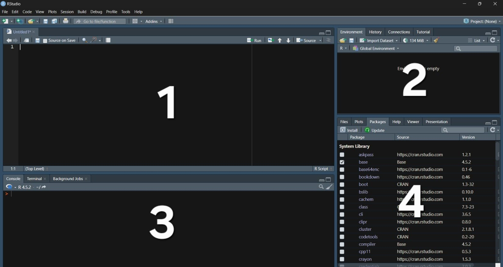

---
# Só mude aqui!!!!
author: "Igor e Lucas"
title: "Relatório sobre a linguagem R"
bibliography: referencias.bib
# A partir daqui nao faca alteracoes!!!!!
link-citations: true
csl: associacao-brasileira-de-normas-tecnicas-ipea.csl
subtitle: "<a href='https://bendeivide.github.io/courses/epaec/' target='_blank'>Estatística e Probabilidade</a> </br> <a href='https://bendeivide.github.io' target='_blank'>Prof. Ben Dêivide (DEFIM/CAP/UFSJ)</a>"
include-before-body: header.html
date: now
date-format: "DD/MM/YYYY, HH:mm"
lang: pt-BR
format:
  html:
    toc: true
    number-sections: true
    theme: bootstrap
    #css: styles.css
    code-fold: true
    code-tools: true
execute:
  echo: true
  warning: false
  message: false
---


## 📌 Introdução

A linguagem [R](https://www.r-project.org/) foi criada em 1993, por Ross Ihaka e Robert Gentleman na [University of Auckland](https://www.auckland.ac.nz/en.html).

## ❓ POR QUAL MOTIVO A LINGUAGEM R FOI CRIADA?

2 O principal objetivo era criar uma linguagem para:

- A área de estatística e análise de dados;
- De fácil uso tanto para pesquisadores quanto para estudantes;
- E ser uma linguagem gratuita e de código aberto;

2.1 Antes de sua criação, muitos softwares estatísticos eram caros e fechados, como a linguagem [S](https://en.wikipedia.org/wiki/S_(programming_language)) 	(que inspirou o desenvolvimento da linguagem R). 

2.2 Logo o R surgiu como uma alternativa mais flexível e bastante importante que acompanhou as demandas científicas modernas.

## POR QUE O R FICOU TÃO IMPORTANTE?

3.1 Hoje em dia com o grande avanço da tecnologia e da inteligência artificial, a linguagem R está sendo muito usada para: 

- Machine Learning;
- Ciência de dados e estatística;
- Pesquisas e práticas acadêmicas;

3.2 A linguagem R conseguiu se adaptar de maneira rápida ao cenário atual graças às suas milhares de bibliotecas, bem como às suas capacidades de geração gráfica e análise.


## Ambiente de trabalho

4.1 A linguagem R é o sistema responsável por fazer os cálculos, manipular os dados e apresenta as bibliotecas.

4.2 Já o RStudio é o ambiente de trabalho conhecido como IDE, que oferece uma interface mais organizada e separada.

 

4.3 Na figura 1, é possível observar as divisões por quadrantes no RStudio, no qual: 

1) Corresponde a área de criação dos scripts;
2) Representa o painel Environment, onde são exibidas as variáveis carregadas na sessão;
3) Indica o console, a onde pode ser executado comandos de maneira direta;
4) Corresponde ao painel de Viewer,Packages,Help,Files,utilizados para a instalação de pacotes, gerenciamento de arquivos e visualização dos dados.


## 💻 Como executar códigos

5.1 Os códigos na linguagem R podem ser executados tanto por scripts quanto pelo console no RStudio.

5.2 A seguir, será representado um código simples:

```{r}

library(leem)

x <- c(1, 2, 3, 4, 5)
mean(x)

```

5.3 O código acima cria um vetor numérico de tamanho 5 e calcula a sua média, demonstrando uma das funções básicas da linguagem R.


## Aprenda Quarto

Acesse [Quarto](https://quarto.org/).

## 📖 Referências