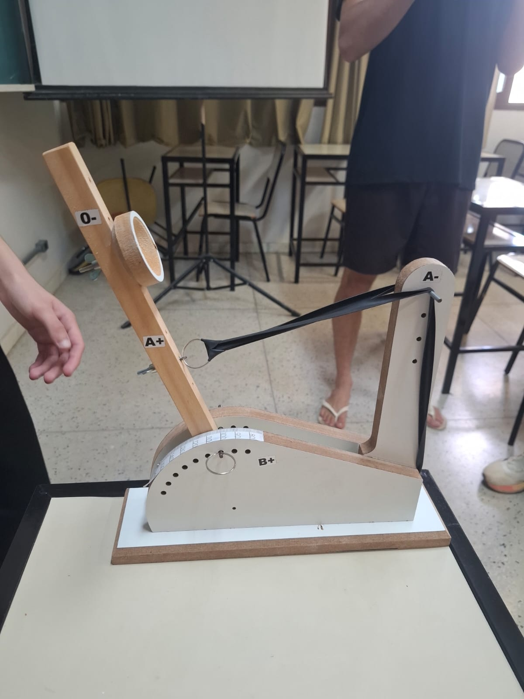
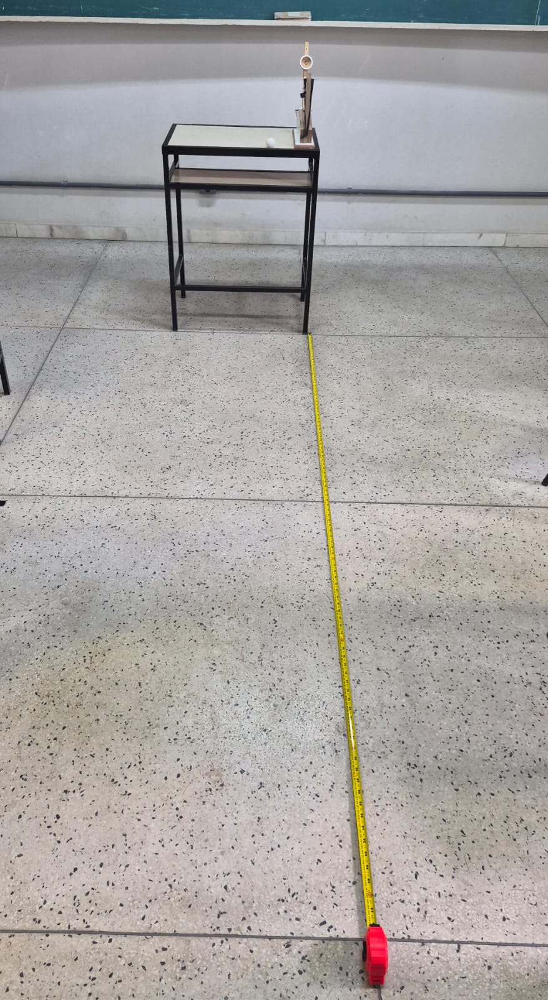

---
# Só mude aqui!!!!
author: "Igor e Lucas"
title: "Relatório de Aula Prática 04"
bibliography: referencias.bib
# A partir daqui nao faca alteracoes!!!!!
link-citations: true
csl: associacao-brasileira-de-normas-tecnicas-ipea.csl
subtitle: "<a href='https://bendeivide.github.io/courses/epaec/' target='_blank'>Estatística e Probabilidade</a>   <a href='https://bendeivide.github.io' target='_blank'>Prof. Ben Dêivide (DEFIM/CAP/UFSJ)</a>"
include-before-body: header.html
date: now
date-format: "DD/MM/YYYY, HH:mm"
lang: pt-BR
format:
  html:
    toc: true
    toc-depth: 3
    toc-location: right
    toc-expand: true
    smooth-scroll: true
    number-sections: true
    theme: cosmo

execute: 
  echo: true
  warning: false
  message: false
---

## 📌 Introdução

Este relatório representa a análise estatística do experimento da catapulta realizado em sala de aula. O objetivo foi coletar e descrever informações dos dados de arremesso para compreender as variabilidades e os comportamentos de um sistema físico sob condições não controladas.

## 📝 Metodologia

### - Organização da Equipe e Divisão de Tarefas

A turma foi dividia em dois grandes grupos. Para garantir a variação na coleta dos **40 resultados**, o grupo deste relatório subdividiu-se nas seguintes funções:

* **Operadores da Catapulta:** Responsáveis pelo lançamento e pela estabilização da base do instrumento, visando reduzir a movimentação da catapulta. (Marcos e Maria Eduarda)
* **Equipe de Metrologia:** Responsáveis pelas medições das distâncias de arremesso a partir do local dos lançamentos. (Igor e Lucas).
* **Relatoria e Registro:** Responsáveis pela tabulação dos dados brutos e pelo registro fotográfico das configurações dos instrumentos. (João Pedro e Wadmilson)

### - Configurações usadas na catapulta

O experimento utilizou as seguintes configurações:

* **A+:** Posição 2 - Define a pré-tensão do elástico.
* **A-:** Posição 1 - Ponto de ancoragem.
* **O-:** Posição 3 - Define o ângulo de saída do projétil.
* **B+:** Posição 7 - Define a alavanca de força no braço móvel.

{width=50%}

### - Coleta  

Foram realizado 40 arremessos. As medidas foram feitas a partir de uma distância de 2,5m da catapulta. O cálculo dessa distância foi utilizando os pisos como referência.

{width=50%}

### - Ajuste de resultados

Para se obter a distância real, aplicamos uma correção de 250cm a cada observação coletada, compensando o deslocamento incial da base da catapulta e o ponto zero da trena.

**Exemplos práticos utilizando uns dos valores encontrados:**

$$x_i = d_i + 250$$

* **Para o 1ª resultado ($d_1 = 96,0$ cm):**
    $$x_1 = 96,0 + 250 = 346,0 \text{ cm} \text{ (Resultado Real)}$$
    
    
    
## 📊 Desenvolvimento analítico

Apresentação dos dados fundamentais coletados durante o experimento antes de utilzarmos no R: 

### - Organização dos dados em rol

Primeiro, organizamos os 40 valores ajustados em ordem crescente (centímetros):

257.9, 275.0, 293.5, 302.5, 317.0, 318.0, 320.0, 323.0, 324.0, 325.0, 328.0, 329.0, 330.0, 331.0, 331.0, 332.5, 332.5, 333.0, 334.0, 335.0, 336.5, 336.5, 338.0, 339.0, 339.0, 339.0, 339.0, 340.0, 341.0, 341.0, 341.0, 346.0, 347.5, 350.0, 352.0, 357.0, 359.0, 365.0, 368.5, 369.0.

