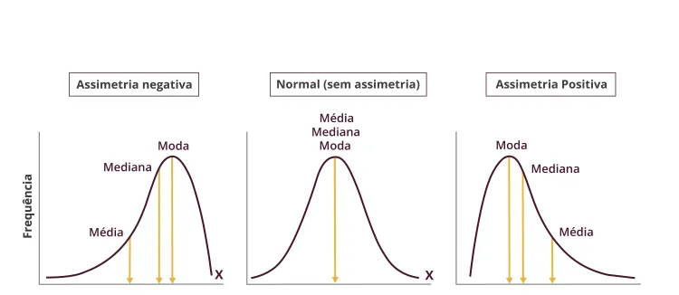
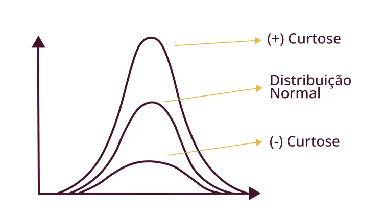

---
# Só mude aqui!!!!
author: "Igor e Lucas"
title: "Relatório sobre a linguagem R"
bibliography: referencias.bib
# A partir daqui nao faca alteracoes!!!!!
link-citations: true
csl: associacao-brasileira-de-normas-tecnicas-ipea.csl
subtitle: "<a href='https://bendeivide.github.io/courses/epaec/' target='_blank'>Estatística e Probabilidade</a> </br> <a href='https://bendeivide.github.io' target='_blank'>Prof. Ben Dêivide (DEFIM/CAP/UFSJ)</a>"
include-before-body: header.html
date: now
date-format: "DD/MM/YYYY, HH:mm"
lang: pt-BR
format:
  html:
    toc: true
    number-sections: true
    theme: bootstrap
    #css: styles.css
    code-fold: true
    code-tools: true
execute:
  echo: true
  warning: false
  message: false
---


## 📌 Introdução

Este relatório representa a análise estatística do experimento da catapulta realizado em sala de aula. O objetivo foi coletar e descrever informações dos dados de arremesso para compreender as variabilidades e os comportamentos de um sistema físico sob condições não controladas.


## 📝 Metodologia

### - Organização da Equipe e Divisão de Tarefas

A turma foi dividia em dois grandes grupos. Para garantir a variação na coleta dos **40 resultados**, o grupo deste relatório subdividiu-se nas seguintes funções:

* **Operadores da Catapulta:** Responsáveis pelo lançamento e pela estabilização da base do instrumento, visando reduzir a movimentação da catapulta. (Marcos e Maria Eduarda)
* **Equipe de Metrologia:** Responsáveis pelas medições das distâncias de arremesso a partir do local dos lançamentos. (Igor e Lucas).
* **Relatoria e Registro:** Responsáveis pela tabulação dos dados brutos e pelo registro fotográfico das configurações dos instrumentos. (João Pedro e Wadmilson)


### - Configurações usadas na catapulta

O experimento utilizou as seguintes configurações:

* **A+:** Posição 2 - Define a pré-tensão do elástico.
* **A-:** Posição 1 - Ponto de ancoragem.
* **O-:** Posição 3 - Define o ângulo de saída do projétil.
* **B+:** Posição 7 - Define a alavanca de força no braço móvel.

{width=50%}

### - Coleta  

Foram realizado 40 arremessos. As medidas foram feitas a partir de uma distância de 2,5m da catapulta. O cálculo dessa distância foi utilizando os pisos como referência.

{width=50%}

### - Ajuste de resultados

Para se obter a distância real, aplicamos uma correção de 250cm a cada observação coletada, compensando o deslocamento incial da base da catapulta e o ponto zero da trena.


**Exemplos práticos utilizando uns dos valores encontrados:**


$$x_i = d_i + 250$$

* **Para o 1ª resultado ($d_1 = 96,0$ cm):**
    $$x_1 = 96,0 + 250 = 346,0 \text{ cm} \text{ (Resultado Real)}$$
    
    
    
## 📊 Desenvolvimento analítico

Apresentação dos dados fundamentais coletados durante o experimento antes de utilzarmos no R: 


### - Organização dos dados em rol

Primeiro, organizamos os 40 valores ajustados em ordem crescente (centímetros):

257.9, 275.0, 293.5, 302.5, 317.0, 318.0, 320.0, 323.0, 324.0, 325.0, 328.0, 329.0, 330.0, 331.0, 331.0, 332.5, 332.5, 333.0, 334.0, 335.0, 336.5, 336.5, 338.0, 339.0, 339.0, 339.0, 339.0, 340.0, 341.0, 341.0, 341.0, 346.0, 347.5, 350.0, 352.0, 357.0, 359.0, 365.0, 368.5, 369.0.


### - Medidas de Posição

Representação das formúlas que utilzamos no cálculo dos resultados do experimento

#### - Média Aritmética($\bar{x}$)

Representa um valor de equilíbrio dos resultados obtidos. Para calcular somamos todas as distâncias reais ($x_i$) e dividimos pelo número total de arremessos ($n = 40$).

$$\bar{x} = \frac{1}{n}\sum_{i=1}^{n} x_i = \frac{13313,4}{40} = 332,84 \text{ cm}$$

#### - Mediana($Md$) 

Como o número de observações é par ($n = 40$), a mediana será a média arimética dos valores centrais localizados nas posições $20^a$ e $21^a$ em Rol:

$$Md = \frac{x_{(20)} + x_{(21)}}{2} = \frac{335,0 + 336,5}{2} = 335,75 \text{ cm}$$

### - Medidas de Dispersão

As medidas de dispersão indicam a consistência dos arremessos da equipe.

#### - Amplitude Total ($R$) 

Diferença entre o maior e o menor valor, indicando o alcance da variação.

$$R = x_{max} - x_{min} = 369,0 - 257,9 = 111,1 \text{ cm}$$

#### - Desvio Padrão ($s$) 

Enquanto a média nos mostra onde a maioria dos arremessos atingiu, o Desvio Padrão mede a nossa consistência. Ele revela a "margem de erro" média dos nossos resultados: quanto maior o desvio, mais "espalhados" foram os nossos tiros; quanto menor, mais precisos fomos.

A fórmula utilizada é :

$$s = \sqrt{\frac{\sum_{i=1}^{n} (x_i - \bar{x})^2}{n - 1}}$$

Aplicando aos dados coletados, encontramos:

$$
s \approx 22,0 \text{ cm}
$$
O desvio padrão representa que em média, os valores se afastam aproximadamente 22,0 cm da média, evidenciando a variabilidade dos arremessos realizados.

### - Verficação computacional no R

```{r}
dados <- c(257.9, 275.0, 293.5, 302.5, 317.0, 318.0, 320.0, 323.0, 
           324.0, 325.0, 328.0, 329.0, 330.0, 331.0, 331.0, 332.5, 
           332.5, 333.0, 334.0, 335.0, 336.5, 336.5, 338.0, 339.0, 
           339.0, 339.0, 339.0, 340.0, 341.0, 341.0, 341.0, 346.0, 
           347.5, 350.0, 352.0, 357.0, 359.0, 365.0, 368.5, 369.0)

n <- length(dados)
media <- mean(dados)
  
dp <- sqrt(sum((dados - media)^2) / (n - 1))

knitr::kable(data.frame(
  Media = media,
  Mediana = median(dados),
  Desvio_Padrao = dp
), digits = 2)
```
### - Análise com agrupamento de dados

O agrupamento de dados colabora para uma análise mais geral da distribuição, facilitando a identificação de padrões. Contudo, ocorre a perca dos valores originais, uma vez que os dados ficam organizados por classes de frequência.  
    
```{r}
library(leem)

dados_leem <- new_leem(dados, variable = "continuous")

tabela <- tabfreq(dados_leem)

tabela
```

A tabela acima apresenta a distribuição dos resultados em classes de frequência, permitindo uma visão mais geral da concentração que os arremessos tiveram.

### - Comparação entre dados agrupados e não agrupados

Ao comparar os resultados agrupados e não agrupados, percebe-se que a média e o desvio padrão são próximos, mas não com os mesmos valores. Isso acontece porque, ao agrupar os dados, utilizamos intervalos e pontos médios, o que aproxima os valores originais e pode gerar pequenas diferenças nos cálculos. Portanto, o agrupamento é uma ferramenta eficiente, mas apresenta uma pequena perda de precisão em relação aos dados originais.

#### - Representação gráfica

```{r}
hist(dados,
     main = "Distribuição das distâncias dos arremessos",
     xlab = "Distância (cm)",
     ylab = "Frequência")
```


### - Assimetria e Curtose

A assimetria mede se os dados estão mais concentrados mais à esquerda ou à direita da média.

Já a curtose indica o grau de concentração dos dados em torno da média, mostrando se a distribuição apresenta maior concentração central ou maior dispersão.

<div style="display: flex; gap: 20px;">
  
  
</div>

A análise da assimetria e da curtose são importantes pois permitem compreender melhor o comportamento da distribuição dos dados, indo além das medidas tradicionais como média e desvio padrão. Essas medidas ajudam a identificar padrões, tendências e possíveis irregularidades nos resultados do experimento.

### - Análise de Eventos de Erro e Fontes de Variabilidade no Experimento da Catapulta

  O experimento da catapulta, por sua natureza, está sujeito a diversas fontes de variabilidade. Estas podem ser categorizadas como intrínsecas (relacionadas ao sistema da catapulta e projétil) e extrínsecas (relacionadas à operação e medição).

* **Variabilidade Intrínseca do Sistema**: 

  * **Consistência do Elástico (A+)**:
  
    A pré-tensão do elástico (Posição 2) é um fator
crítico. Pequenas variações na elasticidade do material ou na forma como é
tensionado a cada arremesso podem gerar diferenças significativas na força
aplicada ao projétil, impactando diretamente a distância. O desgaste do elástico
ao longo dos 40 arremessos também pode ser uma fonte de variabilidade
gradual. 

  * **Ângulo de Saída do Projétil (O-)**:
  
    A posição 3 define o ângulo de saída. Mesmo
que visualmente pareça constante, pequenas inclinações ou desalinhamentos do
braço da catapulta no momento do lançamento podem alterar o ângulo,
resultando em trajetórias e distâncias diferentes. 


* **Variabilidade Extrínseca (Erros Operacionais e de Medição)**:

  * **Erro Humano na Operação (Operadores da Catapulta)**: 
  
    A estabilização da base do instrumento e o lançamento manual (Marcos e Maria Eduarda) são pontos
críticos. Movimentos involuntários, força inconsistente ao segurar a base ou
diferenças na liberação do projétil podem introduzir variabilidade considerável.

  * **Erro Humano na Metrologia (Equipe de Metrologia)**: 
  
    A medição das distâncias (Igor e Lucas) é suscetível a erros. A precisão na leitura da trena, o alinhamento
correto com o ponto de queda do projétil e a interpretação do ponto exato de
impacto podem variar entre as medições. A correção de 250 cm, embora
essencial, depende da precisão da medição inicial da distância da catapulta.

 * **Condições Ambientais**: 
 
    Variações na corrente de ar, umidade ou temperatura do
ambiente, mesmo que sutis, podem influenciar a trajetória do projétil,
especialmente em um experimento com 40 arremessos ao longo do tempo.

### - Conclusão

 * O experimento da catapulta, apesar de realizado em condições não controladas, forneceu um conjunto de dados robusto para análise estatística. As medidas de posição (média e mediana) e dispersão (amplitude e desvio padrão) revelaram que os arremessos, embora variáveis, exibem uma tendência central clara.

 * A inclusão da análise de assimetria e curtose enriquece significativamente a compreensão do comportamento do sistema. A assimetria negativa indica que a equipe tendeu a realizar arremessos mais longos, com uma menor frequência de arremessos muito curtos, mas que impactam a média. A leptocurtose sugere que, além de uma concentração de arremessos em torno da média, houve também a ocorrência de valores mais extremos, tanto para distâncias maiores quanto menores, o que pode ser atribuído à variabilidade inerente ao processo de lançamento manual e às configurações da catapulta. Esses insights são cruciais para futuras otimizações, pois apontam para a necessidade de investigar os fatores que levam aos arremessos mais curtos e aos valores extremos, a fim de melhorar a consistência e a precisão dos lançamentos. 
