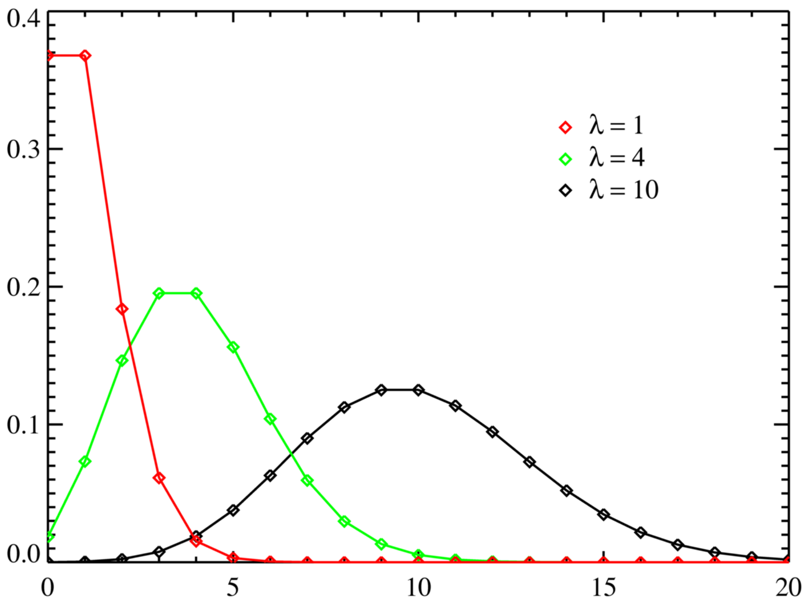

---
# Só mude aqui!!!!
author: "Igor e Lucas"
title: "Relatório 05: Aproximação das Distribuições Binomial e Poisson à Distribuição Normal"
bibliography: referencias.bib
# A partir daqui nao faca alteracoes!!!!!
link-citations: true
csl: associacao-brasileira-de-normas-tecnicas-ipea.csl
subtitle: "<a href='https://bendeivide.github.io/courses/epaec/' target='_blank'>Estatística e Probabilidade</a> </br> <a href='https://bendeivide.github.io' target='_blank'>Prof. Ben Dêivide (DEFIM/CAP/UFSJ)</a>"
include-before-body: header.html
date: today
lang: pt-BR
format:
  html:
    toc: true
    number-sections: true
    theme: bootstrap
    #css: styles.css
    code-fold: true
    code-tools: true
execute:
  echo: true
  warning: false
  message: false
---

## 📢Introdução

As distribuições de probabilidade são essenciais na Estatística, sendo utilizadas para analisar diversas áreas da ciência e da engenharia. Entre as várias distribuições destacam-se a Binomial e a Poisson. Em determinadas situações, essas distribuições podem ser aproximadas pela distribuição Normal, facilitando o cálculo probabilístico e análises estatísticas. Este relatório apresenta os fundamentos teóricos dessas aproximações, demonstrações matemáticas e aplicações utilizando a linguagem R.

## 🎯Objetivos

### Objetivo Geral

Analisar como as distribuições Binomial e Poisson podem ser aproximadas à distribuição Normal.

### Objetivos Específicos

- Apresentar os conceitos das distribuições;
- Demonstrar como ocorre as aproximações; 
- Aplicar exemplos práticos;
- Implementar utilizando a linguagem R;
- Comparar os resultados obtidos.


## 📝Metodologia 

O trabalho foi desenvolvido por meio de estudos realizados em sala de aula e pesquisas bibliográficas sobre as distribuições Binomial, Poisson e Normal. Foram realizados cálculos e exemplos práticos utilizando a linguagem R e o pacote leem no RStudio, com o objetivo de compreender as aproximações das distribuições.

## Distribuição Binomial

A distribuição Binomial é muito utilizada em experimentos aleatórios nos quais existem apenas dois resultados possíveis no experimento (Sucesso ou Fracasso).

A função de probabilidade da distribuição Binomial é dada pela fórmula:

$$P(X = k)=\binom{n}{k}p^k(1-p)^{n-k}$$
Onde:

*   $X$: é a variável aleatória e representa o número de sucessos obtidos;
*   $k$: representa a quantidade exata de sucessos desejada; 
*   $n$: o número total de tentativas;
*   $p$: a probabilidade de acerto em cada tentativa;
*   $(1-p)$: é a probabilidade de fracasso;
*   $\binom{n}{k}$: calcula a quantidade de maneiras diferentes que o sucesso pode acontecer.


### Aproximação Binomial pela Normal

A aproximação da Distribuição Binomial à Distribuição Normal acontece quando o número de tentativas fica muito grande. Nessa condição, a distribuição Binomial passa a apresentar formato ao da curva Normal.


A variável Binomial pode ser analisada como a soma de várias variáveis aleatórias independentes de Bernoulli. 


$$X=X_1+X_2+\cdots+X_n$$
Segundo o Teorema Central do Limite, a soma de um grande número de variáveis aleatórias independentes tende a seguir uma distribuição Normal, mesmo que as variáveis originais usadas sejam discretas.

A aproximação é vantajosa nos casos em que: 

$$np \geq 5$$

e

$$n(1-p)\geq 5$$
Com essas condições, a distribuição aproximada terá média:


$$\mu=np$$

e desvio padrão:

$$\sigma=\sqrt{np(1-p)}$$
Exemplo Utilizando R:

```{R}
library(leem)

# Aproximação Binomial pela Normal

# Parâmetros da distribuição
n <- 100
p <- 0.1
k <- 15

# Probabilidade Binomial exata
prob_binomial <- pbinom(
  q = k,
  size = n,
  prob = p
)

# Média da aproximação Normal
media <- n*p

# Desvio padrão
desvio <- sqrt(n*p*(1-p))

# Aproximação pela Normal
prob_normal <- pnorm(
  q = k + 0.5,
  mean = media,
  sd = desvio
)

# Resultados
prob_binomial
prob_normal
```

Observa-se que a probabilidade calculada pela distribuição Binomial e pela aproximação Normal apresentou valores próximos. Isso demonstra que, para valores de $n$ grandes, a aproximação Normal fornece resultados condizentes.

## Distribuição de Poisson 

A distribuição de Poisson é uma distribuição de probabilidade discreta aplicada a cenários em que o interesse está em contabilizar o número de vezes que um evento ocorre dentro de um intervalo contínuo específico (seja de tempo, área, volume ou espaço).

A função de probabilidade da distribuição de Poisson é expressa por: $$P(X = k) = \frac{e^{-\lambda} \lambda^k}{k!}$$

Onde:

* $X$: é a variável aleatória que representa o número de ocorrências do evento;
* $k$: é o número de sucessos desejado ($k = 0, 1, 2, \dots$);
* $\lambda$: é a taxa média de ocorrências no intervalo considerado (representa tanto a média quanto a variância da distribuição);
* $e$: é a constante de Euler, aproximadamente igual a 2,71828.

### Aproximação da Poisson pela Normal

Assim como ocorre na distribuição Binomial, a distribuição de Poisson se aproxima de uma curva Normal à medida que o seu parâmetro central cresce. Quando a taxa média de ocorrências ($\lambda$) assume valores grandes, a assimetria característica da Poisson diminui, tornando a distribuição simétrica e com o formato de sino clássico da distribuição Normal. Essa convergência baseia-se no Teorema Central do Limite. Um processo de Poisson com parâmetro $\lambda$ pode ser interpretado como a soma de $\lambda$ processos independentes de Poisson com taxa igual a 1. À medida que $\lambda \to \infty$, a distribuição dessa soma converge para uma distribuição Normal.



A aproximação pela Normal é considerada robusta e recomendada quando a taxa média atende ao seguinte critério: 

$$\lambda \geq 10$$

Sob essa condição, a distribuição Normal aproximada assumirá os seguintes parâmetros:

Média: 

$$\mu = \lambda$$

Desvio padrão: 

$$\sigma = \sqrt{\lambda}$$

### Correção de Continuidade

Como estamos utilizando uma distribuição contínua (Normal) para aproximar uma distribuição discreta (Poisson ou Binomial), é indispensável aplicar a correção de continuidade. Isso consiste em ajustar os limites do intervalo discreto por um fator de $\pm 0,5$ para que a área sob a curva contínua represente fielmente a probabilidade acumulada dos degraus discretos.

Exemplo Utilizando R:

```{R}
library(leem)

# Aproximação da Poisson pela Normal

# Parâmetros da distribuição
lambda <- 16  # Taxa média de ocorrências (satisfaz lambda >= 10)
k <- 20       # Deseja-se calcular P(X <= 20)

# Probabilidade Poisson exata
prob_poisson <- ppois(
  q = k, 
  lambda = lambda
)

# Média da aproximação Normal
media_p <- lambda

# Desvio padrão da aproximação Normal
desvio_p <- sqrt(lambda)

# Aproximação pela Normal (aplicando correção de continuidade: k + 0.5)
prob_normal_p <- pnorm(
  q = k + 0.5, 
  mean = media_p, 
  sd = desvio_p
)

# Resultados
prob_poisson
prob_normal_p
```

* **Comparação e Discussão dos Resultados:**

* Caso Binomial ($n = 100$, $p = 0.1$):

As condições de validação foram atendidas: $np = 10 \geq 5$ e $n(1-p) = 90 \geq 5$. A probabilidade exata calculada via pbinom e a estimada via pnorm (com correção de continuidade) apresentam divergências mínimas (na ordem de casas decimais avançadas), o que valida a aproximação.

* Caso Poisson ($\lambda = 16$):

A condição estabelecida foi atendida: $\lambda = 16 \geq 10$.O cálculo exato por ppois e a aproximação por pnorm resultam em valores extremamente próximos. A inclusão do fator de $+0,5$ garante que o erro de discretização seja mitigado com eficácia.

## 🗪  Resultados e Discussão

Os resultados obtidos demonstraram que as aproximações pela distribuição Normal forneceram valores bastante próximos às probabilidades exatas calculadas pelas distribuições Binomial e Poisson, quando se tem valores de $np$, $n(1-p)$ e $\lambda$ bastante grandes.

Na distribuição Binomial, foi possível observar que, para valores elevados de $np$ e $n(1-p)$, a aproximação Normal apresentou resultados muito precisos em relação à distribuição Binomial.

Para a distribuição Poisson, verificou-se que o aumento do parâmetro $\lambda$ reduz a assimetria da distribuição, fazendo com que esta distribuição fique bastante semelhante à curva Normal.

## 💡 Conclusão

Portanto, as distribuições Binomial e Poisson podem ser aproximadas pela distribuição Normal sob determinadas condições.

Na distribuição Binomial, a aproximação ocorre quando os valores de $(np)$ e $(n(1-p))$ são bastante grandes. Já na distribuição Poisson, a aproximação apresenta boa precisão quando o parâmetro $(\lambda)$ assume valores elevados.

Os exemplos desenvolvidos na linguagem R utilizando o pacote leem mostraram que as probabilidades aproximadas apresentaram valores bem próximos aos cálculos exatos, principalmente após a aplicação da correção de continuidade.

Dessa forma, os objetivos propostos neste relatório foram atingidos satisfatoriamente.

## 📑  Referências

[1] MORETTIN, P. A.; BUSSAB, W. O. Estatística Básica. 9. ed. São Paulo: Saraiva, 2017.

[2] MONTGOMERY, D. C.; RUNGER, G. C. Applied Statistics and Probability for Engineers. 6. ed. Hoboken, NJ: John Wiley & Sons, Inc., 2014.

[3] DÊIVIDE, B. Estatística e Probabilidade Aplicada à Engenharia. Material da disciplina disponibilizado no curso de Estatística e Probabilidade, Universidade Federal de São João del-Rei (UFSJ), 2026.