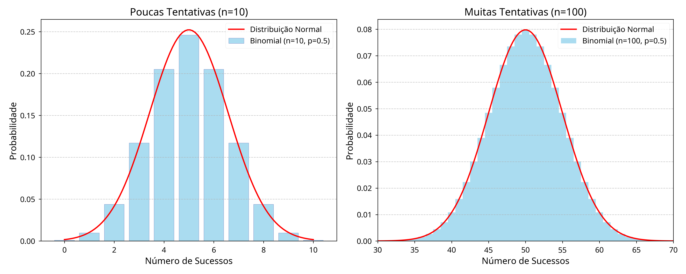

---
# Só mude aqui!!!!
author: "Igor e Lucas"
title: "Relatório 05: Aproximação das Distribuições Binomial e Poisson à Distribuição Normal"
bibliography: referencias.bib
# A partir daqui nao faca alteracoes!!!!!
link-citations: true
csl: associacao-brasileira-de-normas-tecnicas-ipea.csl
subtitle: "<a href='https://bendeivide.github.io/courses/epaec/' target='_blank'>Estatística e Probabilidade</a> </br> <a href='https://bendeivide.github.io' target='_blank'>Prof. Ben Dêivide (DEFIM/CAP/UFSJ)</a>"
include-before-body: header.html
date: today
lang: pt-BR
format:
  html:
    toc: true
    number-sections: true
    theme: bootstrap
    #css: styles.css
    code-fold: true
    code-tools: true
execute:
  echo: true
  warning: false
  message: false
---

## 📢Introdução

As distribuições de probabilidade são essenciais na Estatística, sendo utilizadas para analisar diversas áreas da ciência e da engenharia. Entre as várias distribuições destacam-se a Binomial e a Poisson. Em determinadas situações, essas distribuições podem ser aproximadas através da distribuição Normal, facilitando o cálculo probabilístico e análises estatísticas. Este relatório apresenta os fundamentos teóricos dessas aproximações, demonstrações matemáticas e aplicações utilizando a linguagem R.

## 🎯Objetivos

### Objetivo Geral

Analisar como as distribuições Binomial e Poisson podem ser aproximadas à distribuição Normal.

### Objetivos Específicos

- Apresentar os conceitos das distribuições;
- Demonstrar como ocorre as aproximações; 
- Aplicar exemplos práticos;
- Implementar utilizando a linguagem R;
- Comparar os resultados obtidos.


## 📝Metodologia 

O trabalho foi desenvolvido por meio de estudos realizados em sala de aula e pesquisas bibliográficas sobre as distribuições Binomial, Poisson e Normal. Foram realizados cálculos e exemplos práticos utilizando a linguagem R e o pacote leem no RStudio, com o objetivo de compreender as aproximações das distribuições.

## Distribuição Binomial

A distribuição Binomial é muito utilizada em experimentos aleatórios nos quais se possui apenas dois resultados possíveis no experimento (Sucesso ou Fracasso).

A função de probabilidade da distribuição Binomial é dada pela fórmula:

$$P(X = k)=\binom{n}{k}p^k(1-p)^{n-k}$$
Onde:

*   $X$: é a variável aleatória e representa o número de sucessos obtidos;
*   $k$: representa a quantidade exata de sucessos desejada; 
*   $n$: o número total de tentativas;
*   $p$: a probabilidade de acerto em cada tentativa;
*   $(1-p)$: é a probabildade de fracasso;
*   $\binom{n}{k}$: calcula a quantidade de maneiras diferentes que o sucesso pode acontecer.


## Aproximação Binomial pela Normal

A aproximação da Distribuição Binomial à Distribuição Normal acontece quando o número de tentativas fica muito grande. Nessa condição, a distribuição Binomial passa a apresentar formato ao da curva Normal.  


A variável Binomial pode ser analisada como a soma de várias variáveis aleatórias independentes de Bernoulli. 


$$X=X_1+X_2+\cdots+X_n$$
Segundo o Teorema Central do Limite, a soma de um grande número de variáveis aleatórias independentes tendem a seguir uma distribuição Normal, mesmo que as variáveis originais usadas sejam discretas.

A aproximação é vantajosa nos casos em que: 

$$np \geq 5$$

e

$$n(1-p)\geq 5$$
Com essas condições, a distribuição aproximada terá média:


$$\mu=np$$

e desvio padrão:

$$\sigma=\sqrt{np(1-p)}$$
Exemplo Utilizando R:

```{R}
library(leem)

# Aproximação Binomial pela Normal

# Parâmetros da distribuição
n <- 100
p <- 0.1
k <- 15

# Probabilidade Binomial exata
prob_binomial <- pbinom(
  q = k,
  size = n,
  prob = p
)

# Média da aproximação Normal
media <- n*p

# Desvio padrão
desvio <- sqrt(n*p*(1-p))

# Aproximação pela Normal
prob_normal <- pnorm(
  q = k + 0.5,
  mean = media,
  sd = desvio
)

# Resultados
prob_binomial
prob_normal
```

Observa-se que a probabilidade calculada pela distribuição Binomial e pela aproximação Normal apresentaram valores próximos. Isso demonstra que, para valores de n grandes, a aproximação Normal fornece resultados condizentes.

