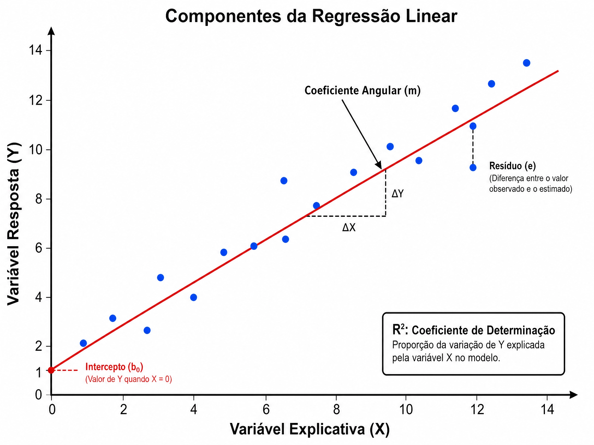

---
# Só mude aqui!!!!
author: "Igor e Lucas"
title: "Estudo de regressão linear"
bibliography: referencias.bib
# A partir daqui nao faca alteracoes!!!!!
link-citations: true
csl: associacao-brasileira-de-normas-tecnicas-ipea.csl
subtitle: "<a href='https://bendeivide.github.io/courses/epaec/' target='_blank'>Estatística e Probabilidade</a> </br> <a href='https://bendeivide.github.io' target='_blank'>Prof. Ben Dêivide (DEFIM/CAP/UFSJ)</a>"
include-before-body: header.html
date: 07/03/2026
lang: pt-BR
format:
  html:
    toc: true
    number-sections: true
    theme: bootstrap
    #css: styles.css
    code-fold: true
    code-tools: true
execute:
  echo: true
  warning: false
  message: false
---


## Introdução

A regressão linear é uma ferramenta muito utilizada na estatística para estudar a relação entre duas variáveis quantitativas. Neste relatório, foi analisada a distância percorrida por uma bolinhas lançada por uma catapulta em relação aos diferentes ângulos de lançamento. O experimento busca compreender como à variação do ângulo da catapulta pode infulenciar o alcance da bolinha e qual das configuração produz a maior distância.

## Objetivos 

### Objetivo Geral

Estudar a relação entre o ângulo de lançamento e a distância percorrida pela bolinha utilizando técnicas de regressão.

### Objetivos Específicos 

- Coletar dados experimentais da catapulta.
- Ajustar um modelo de regressão.
- Avaliar a influência do ângulo na distância percorrida.  
- Identificar o ângulo associado ao maior alcance.

## Metodologia 

O experimento foi realizado utilizando um catapulta configurada com os níveis $O^-= 2$, $A^+=1$, $A^-=2$. Para o valor $B^+$(ângulo de lançamento) foi utilizado nove graus de inclinação distintos, para cada nível foi realizado dois lançamentos, totalizando dezoito observações.

A distância foi medida tomando como referência o tamanho do piso a uma distância de 1,12m da catapulta. Os desvios observados em centímetros foram convertidos para metros como e utilizados como variável resposta.  

Para a análise estatística foi utilizado a linguagem R, ajustando-se um modelo de regressão entre o ângulo de lançamento e a distância percorrida.

## Fundamentação Teórica

### Regressão Linear 

É um modelo estatístico utilizado para modelar a relação entre duas variáveis através de uma função linear. Estatisticamentem o objetivo é estimar os parâmetros de uma reta que minimize a soma dos quadrados dos resíduos, técnica conhecida como Método dos Mínimos Quadrados.

### Variável Explicativa

Esta variável é utilizada para explicar a variação na variável resposta. Em um modelo de regressão, assume-se que ela não possui erro aleatório e que é controlada pelo pesquisador. No gráfico, ela ocupa o eixo das abscissas (X).

### Variável Resposta

É a variável que se deseja estudar ou analisar. Ela contém um comportamento aleatório (erro) e sua variação, pode ser explicada  pelas mudanças na variável explicativa. No gráfico, ela ocupa o eixo das coordenadas (Y).

### Coeficiente Angular

O coeficiente angular representa a estimativa da variação média na variável resposta para cada unidade de aumento na variável explicativa. Ele indica a inclinação da reta e a direção da relação (positiva ou negativa).

### Coeficiente de Determinação

É uma medida de ajuste que indica a proporção da variância da variável resposta que é explicada pelo modelo linear. Este coeficiente varia de 0 a 1. 

Exemplo: Um $R^2$= 0,98 indica que 98% da variabilidade dos dados de Y é explicada pela relação linear com X, sendo basicamente um indicador global do ajuste do modelo.



Através da imagem, é possível compreender como cada variável se organiza no gráfico de uma função linear. Da fórmula: $Y = β_0+β_1X+ε$  

### Como a regressão se relaciona com a Engenharia Mecatrônica

Na Engenharia Mecatrônica, a regressão linear é fundamental para:

- **Calibração de Sensores**: Todo sensor mecatrônico (um sensor de pressão, um termistor ou um encoder) gera um sinal elétrico (Volts, mA) que precisa ser convertido em uma unidade física (Pascal,°C, Graus).  

Exemplo: O engenheiro coleta vários pontos de dados (Tensão vs Temperatura real). Através da regressão linear, encontra-se a equação que converte o sinal elétrico na medida real. Sem essa informação, o robô ou sistema não entenderia o que está recebendo.

- **Modelagem de Sistemas Dinâmicos**: Geralmente, é preciso prever como um motor ou um braço robótico vai se mover. 

Exemplo: A relação entre a Corrente (A) enviada para um motor e o Torque (Nm) gerado é, em grande parte, linear. Usa-se a regressão linear para identificar as constantes do motor (como a constante de torque $K_t$). Isso permite que o código de controle saiba quanto de energia enviar para obter o movimento desejado.

- **Robótica e Machine Learning**: A regressão linear é peça fundamental para a Inteligência Artificial. Muitos algoritmos de decisão em robôs começam com regressões simples para entender padrões de movimento ou de consumo de energia. É a base para algoritmos mais complexos como os de redes neurais.

## Resultados Obtidos no Experimento

Na tabela abaixo, são representados os valores obtidos experimentalmente para diferentes graus de lançamento da catapulta.Foi utilizado o valor de 1,12 m como referência para a medição do alcance da bolinha, sendo os resultados expressos em relação a essa referência.

| Ângulo (°) | Repetição 1 (m) | Repetição 2 (m) | Médias (m) | 
| :--------: | :-------------: | :-------------: | :--------: |
|     80     |       1,17      |       1,19      |    1,18    |  
|     90     |       1,15      |       1,31      |    1,23    |
|     100    |       1,44      |       1,22      |    1,33    |
|     110    |       1,31      |       1,07      |    1,19    |
|     120    |       0,90      |       0,85      |    0,87    |
|     130    |       1,54      |       1,46      |    1,50    |
|     140    |       0,97      |       0,90      |    0,93    |
|     150    |       0,44      |       0,51      |    0,47    | 


## Aplicação no R

### Dados

```{r}
# Cria um vetor chamado "angulo" com os valores dos ângulos testados no experimento.
# Cada ângulo aparece duas vezes porque foram realizadas duas repetições para cada condição.
angulo <- c(
  80,80,
  90,90,
  100,100,
  110,110,
  120,120,
  130,130,
  140,140,
  150,150
)

# Cria um vetor chamado "distancia" com as distâncias percorridas pela bolinha, em metros.
# A ordem dos valores deve corresponder à ordem dos ângulos no vetor anterior.
distancia <- c(
  1.17,1.19,
  1.155,1.31,
  1.44,1.22,
  1.31,1.07,
  0.90,0.85,
  1.54,1.46,
  0.97,0.90,
  0.44,0.51
)

# Organiza os vetores em uma tabela de dados.
# A função data.frame() cria uma estrutura com linhas e colunas,
# facilitando a análise estatística no R.
dados <- data.frame(angulo, distancia)

# Exibe a tabela criada para conferência dos dados inseridos.
dados
```


### Tabelas das médias

```{r}
# Calcula a média da distância para cada ângulo testado.
# A expressão distancia ~ angulo indica que a distância será agrupada por ângulo.
# O argumento data = dados informa que as variáveis estão no data frame "dados".
# A função mean calcula a média das repetições em cada grupo.
medias <- aggregate(distancia ~ angulo,
                    data = dados,
                    mean)

# Exibe a tabela com a média da distância para cada ângulo.
medias
```


### Gráfico

```{r}
# Ajusta um modelo de regressão linear simples.
# A função lm() estima uma reta que relaciona a variável distancia com a variável angulo.
# A expressão distancia ~ angulo significa que a distância será explicada pelo ângulo.
modelo <- lm(distancia ~ angulo, data = dados)

# Exibe o resumo estatístico do modelo ajustado.
# O summary() mostra os coeficientes da reta, o valor de R² e outras informações do ajuste.
summary(modelo)

# Constrói um gráfico de dispersão com os dados experimentais.
# O eixo X representa o ângulo de lançamento e o eixo Y representa a distância percorrida.
plot(
  dados$angulo,
  dados$distancia,
  pch = 19,
  xlab = "Ângulo (graus)",
  ylab = "Distância (m)",
  main = "Regressão Linear: Distância x Ângulo"
)

# Adiciona ao gráfico a reta de regressão estimada pelo modelo.
# O argumento lwd = 2 aumenta a espessura da linha.
# O argumento col = "red" destaca visualmente a reta ajustada.

```

A função lm() é a principal função usada para ajustar a regressão linear no R. Ela calcula a equação da reta que melhor representa a relação entre as variáveis, de acordo com o método dos mínimos quadrados. A função summary() permite avaliar os resultados numéricos do modelo, como os coeficientes da reta e o coeficiente de determinação. A função plot() constrói o gráfico de dispersão, mostrando cada lançamento como um ponto. O argumento pch = 19 define pontos preenchidos, enquanto xlab, ylab e main definem os textos dos eixos e do título. Por fim, abline() adiciona a reta de regressão sobre os pontos, facilitando a visualização da tendência estimada.

Com os dados apresentados, o modelo linear estimado é aproximadamente:

distância = 1,9423 - 0,0074 * ângulo

## Discussão dos resultados

A análise dos dados mostra que a distância percorrida pela bolinha variou de forma considerável conforme o ângulo de lançamento da catapulta. Observando as médias, o maior alcance ocorreu no ângulo de 130°, com média de aproximadamente 1,50 m. Em seguida, aparecem os ângulos de 100°, com média de 1,33 m, e 90°, com média aproximada de 1,23 m. O menor resultado foi observado em 150°, com média de aproximadamente 0,47 m.

Apesar de a regressão linear ajustada apresentar coeficiente angular negativo, indicando uma tendência geral de redução da distância conforme o ângulo aumenta, essa reta não explica completamente o comportamento observado. O coeficiente de determinação foi aproximadamente R² = 0,308, o que significa que cerca de 30,8% da variação da distância foi explicada pelo ângulo por meio de uma relação linear. Esse valor indica um ajuste limitado, pois grande parte da variação dos dados ainda permanece associada a outros fatores ou a um comportamento não linear.

Esse resultado é coerente com a natureza do experimento. Em lançamentos por catapulta, o alcance pode depender não apenas do ângulo, mas também da força aplicada, da posição inicial da bolinha, do atrito, da repetibilidade do mecanismo, da altura de lançamento e de pequenas diferenças no momento de liberação. Além disso, teoricamente, movimentos de projéteis costumam apresentar comportamento curvilíneo em relação ao ângulo, e não necessariamente uma relação em linha reta.
Também é possível observar variações entre repetições de um mesmo ângulo. Por exemplo, em 100° foram registradas distâncias de 1,44 m e 1,22 m, enquanto em 110° foram obtidas distâncias de 1,31 m e 1,07 m. Essas diferenças mostram que o experimento possui variabilidade prática e que duas repetições por ângulo podem não ser suficientes para representar com grande precisão o comportamento médio de cada configuração.

Portanto, a regressão linear foi útil para fornecer uma primeira leitura estatística da relação entre ângulo e distância, mas os resultados sugerem que o fenômeno não é bem descrito apenas por uma reta. Para estudos futuros, seria interessante aumentar o número de repetições por ângulo e testar também um modelo de regressão quadrática, capaz de representar melhor a existência de um ponto de máximo alcance.

## Conclusão

Com base nos dados coletados, foi possível aplicar a regressão linear para investigar a relação entre o ângulo de lançamento da catapulta e a distância percorrida pela bolinha. O modelo ajustado indicou uma tendência linear negativa, sugerindo que, em média, maiores ângulos estariam associados a menores distâncias. No entanto, essa tendência deve ser interpretada com cautela, pois o maior alcance médio foi observado em 130°, demonstrando que o comportamento experimental não segue uma relação estritamente linear.

O coeficiente de determinação de aproximadamente 30,8% mostra que o ângulo explica apenas parte da variação observada na distância. Isso indica que outros fatores experimentais também influenciaram os resultados, como a regularidade do lançamento, a força da catapulta, a posição da bolinha e possíveis erros de medição.

Assim, conclui-se que a regressão linear contribuiu para organizar e interpretar os dados experimentais, mas não foi suficiente para representar completamente o comportamento do alcance da bolinha. O ângulo de 130° foi o que apresentou melhor desempenho médio no experimento, enquanto uma análise mais aprofundada, com mais repetições e modelos não lineares, poderia fornecer uma representação mais precisa do fenômeno estudado.

## Referências
[1] BATISTA, Ben Deivide. Livro de Estatística. Universidade Federal de São João del-Rei, UFSJ.

[2] MORETTIN, Pedro Alberto; BUSSAB, Wilton de Oliveira. Estatística básica. 9. ed. São Paulo: Saraiva, 2017.
